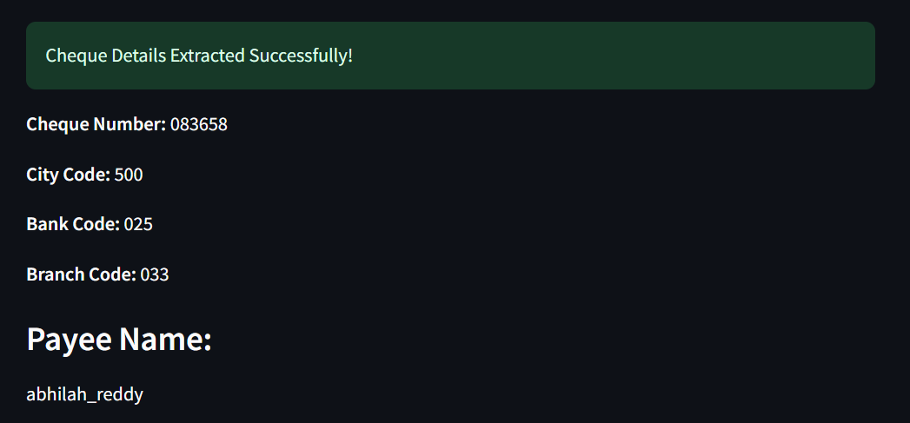

# Cheque Information Extraction System

## Project Overview

The **Cheque Information Extraction System** is a computer vision-based application built using OCR (Optical Character Recognition) techniques and a ResNet model to extract critical details from cheque images. The system identifies the **MICR (Magnetic Ink Character Recognition)** string from the bottom portion of the cheque and extracts key information such as:

- **Cheque Number**
- **City Code**
- **Bank Code**
- **Branch Code**

Additionally, the system uses a ResNet model to detect the **Payee Name** from the cheque image's handwritten part. The project combines OCR techniques, including Tesseract for MICR extraction and a custom handwriting recognition model using ResNet for detecting the payee's name.

This project is built by **Darmila.T** and **Darshika.P**.

## Key Features

1. **Cheque MICR Code Extraction:**

   - Extracts the **Cheque Number**, **City Code**, **Bank Code**, and **Branch Code** from the MICR region.
   - Displays the extracted information clearly.
   - Refer to `Cheque_Information_Extraction_System_CV.ipynb`.

2. **Payee Name Detection:**
   - Detects the payee name using a custom trained handwriting recognition model.
   - Displays the recognized payee name with confidence scores.
   - Refer to `Train_Model_using_MINST_dataset.ipynb`.

## Prerequisites

To run this project locally, ensure you have the following installed:

- **Python 3.7+**
- **Tesseract OCR**: [Installation guide](https://github.com/tesseract-ocr/tesseract)
- **mcr.traineddata**: [Download](https://github.com/BigPino67/Tesseract-MICR-OCR/blob/master/Tessdata/mcr.traineddata)
- **Streamlit**: `pip install streamlit`
- **OpenCV**: `pip install opencv-python`
- **NumPy**: `pip install numpy`
- **Pillow**: `pip install pillow`
- **EasyOCR**: `pip install easyocr`
- **imutils**: `pip install imutils`
- **TensorFlow**: `pip install tensorflow`

## Installation and Setup

1. Clone this repository to your local machine:

   ```bash
   git clone https://github.com/your-username/cheque-information-extraction.git
   cd cheque-information-extraction
   ```

2. **Install Tesseract**:

   - Download and install Tesseract OCR from the [official site](https://github.com/tesseract-ocr/tesseract).
   - After installation, make sure to set the `TESSERACT_CMD` path in the `app.py` file as per your installation path (e.g., `pytesseract.pytesseract.tesseract_cmd = r"C:\Program Files\Tesseract-OCR\tesseract.exe"` for Windows).

3. **Download the Handwriting Model**:
   - Download the pre-trained handwriting recognition model (`handwriting_model.h5`) and place it in the directory where the project files are located.
   - You can use any handwritten text model, or train your own.

## How to Use

1. Launch the Streamlit app using the following command:

   ```bash
   streamlit run app.py
   ```

2. In the web browser, go to the URL shown in the terminal (usually `http://localhost:8501`).

3. Upload a cheque image in **JPEG**, **PNG**, or **JPG** format.

4. After uploading the cheque, the system will:

   - Show the **original cheque image**.
   - Display the **MICR region** of the cheque with the extracted MICR string.
   - Show the **processed image** with the OCR results for the Payee Name.
   - Extract and display the **Cheque Number**, **City Code**, **Bank Code**, **Branch Code**, and **Payee Name**.

5. The results will be displayed on the same page for you to view.

## Example Output

After uploading a cheque, you will see:



[Watch the video demo](https://drive.google.com/file/d/1vLpc9o4BiojcJKP-vprfRK_FME4GTLJy/view?usp=sharing)

## Code Structure

### `cheque_app.py`

Main script for the Streamlit application, including:

- Image upload functionality
- MICR extraction
- Payee Name detection
- Displaying the results

### `handwriting_model.h5`

Pre-trained model file for handwritten text recognition. Ensure this model is downloaded and placed correctly for OCR functionality.
